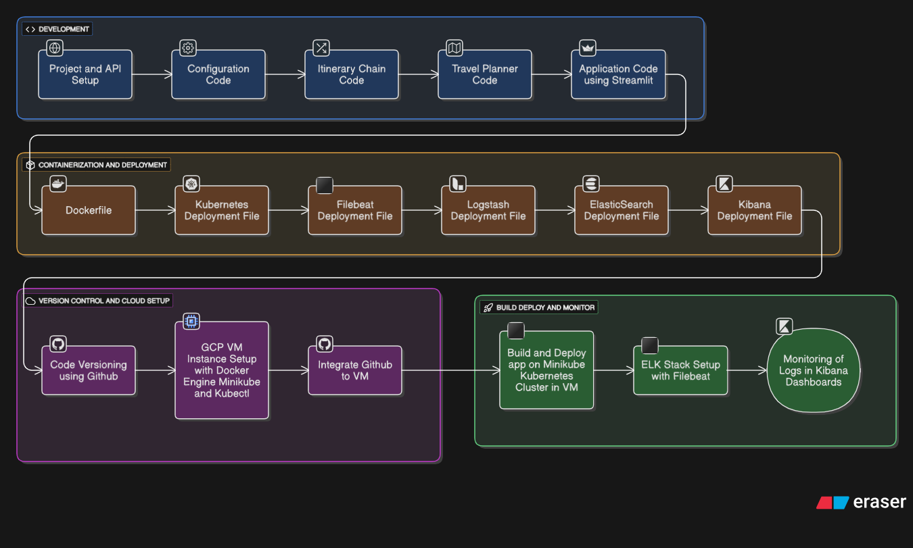

# AI Travel Planner

## Project Overview

The AI Travel Planner is an intelligent travel planning application that helps users generate personalised travel itineraries and destination recommendations using large language models.

Beyond trip planning, this project demonstrates how an AI application can be deployed in a production-style environment using modern LLMOps practices including containerisation, Kubernetes orchestration, cloud deployment, and observability monitoring.

The goal was to combine AI application development with real-world deployment engineering.

---

## Use Case

Planning a trip often requires searching multiple websites, comparing destinations, organising schedules, and manually creating itineraries.

This application simplifies that process by allowing users to interact with an AI-powered travel assistant that generates travel plans based on preferences, making trip planning faster and more convenient.

At the infrastructure level, the project demonstrates how modern AI applications can be deployed, monitored, and managed in scalable environments.

---

## Features

### AI Travel Planning
- Generate personalised travel itineraries
- Destination recommendations based on user preferences
- Interactive AI-powered travel assistant
- Structured itinerary generation using LLM workflows

### Streamlit Web Application
- Simple and interactive frontend interface
- Real-time user interaction
- Fast response generation

### Containerised Deployment
- Application containerised using Docker
- Portable and reproducible deployment environment

### Kubernetes Deployment
- Application deployed using Kubernetes
- Scalable container orchestration using Minikube

### Cloud Infrastructure Deployment
- Google Cloud VM instance provisioning
- Ubuntu server environment setup
- Remote deployment configuration

### Monitoring & Logging
- Centralised logging using ELK Stack
- Filebeat log shipping from Kubernetes workloads
- Logstash log processing
- Elasticsearch indexing
- Kibana dashboard monitoring

---

## Technologies

### Application
- Python
- Streamlit
- LLM API Integration
- Prompt Engineering

### DevOps / LLMOps
- Docker
- Kubernetes
- Minikube
- GitHub
- Google Cloud Platform (GCP)
- Ubuntu Linux

### Monitoring & Logging
- Elasticsearch
- Logstash
- Kibana
- Filebeat
- Prometheus

---

## How It Works

- Users interact with the Streamlit-based travel planner interface
- Travel preferences are processed through LLM workflows
- AI generates personalised travel itineraries and recommendations
- Application is containerised using Docker
- Kubernetes manages deployment and orchestration
- Application runs inside a Minikube cluster hosted on a GCP virtual machine
- Logs are collected using Filebeat
- Logstash processes application logs
- Elasticsearch stores indexed logs
- Kibana provides real-time monitoring dashboards

---

## Architecture Workflow



---

## Installation

### Clone the repository

```bash
git clone https://github.com/gajamsaikumar/ai_travel_agent.git
cd ai_travel_agent
